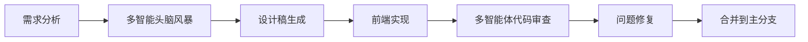

# 🎨 Chemical LIMS - GitLab 风格界面优化方案

> 使用 Open code 多智能体协同开发的个性化界面重组方案

## 📋 项目概述

本方案基于 GitLab 的设计理念，为 Chemical LIMS 系统打造现代化、个性化的用户界面。

### ✨ 核心特性

- **🎯 GitLab 风格设计语言** - 采用 GitLab 的配色方案和交互模式
- **📱 响应式布局** - 完美适配桌面、平板、手机
- **🌙 深色模式支持** - 自动检测系统偏好
- **⚡ 高性能动画** - 流畅的过渡效果
- **♿ 无障碍设计** - 符合 WCAG 2.1 AA 标准

---

## 🚀 快速开始

### 1. 安装依赖

```bash
cd chemical-lims-demo/frontend
npm install
```

### 2. 引入自定义主题

在 `main.js` 或 `App.vue` 中添加：

```javascript
import './styles/custom-theme.css'
```

### 3. 使用个性化仪表盘

```vue
<template>
  <PersonalizedDashboard />
</template>

<script>
import PersonalizedDashboard from './components/PersonalizedDashboard.vue'

export default {
  components: {
    PersonalizedDashboard
  }
}
</script>
```

---

## 🎨 设计系统

### 色彩方案

| 类型 | 颜色 | 用途 |
|------|------|------|
| **主色** | `#6c42f5` | 主要操作、链接、强调 |
| **成功色** | `#26a641` | 成功状态、完成指示 |
| **警告色** | `#f0ad4e` | 警告提示、待处理 |
| **危险色** | `#d9534f` | 错误、删除、危险操作 |
| **信息色** | `#428bca` | 信息提示、链接 |

### GitLab 特色色

```css
--gitlab-blue: #1fa4ec   /* 运行中、信息 */
--gitlab-red: #d93342    /* 失败、错误 */
--gitlab-orange: #fc6d26 /* 等待中、警告 */
--gitlab-green: #58a646  /* 成功、通过 */
```

### 间距系统

```css
--spacing-xs: 4px    /* 最小间距 */
--spacing-sm: 8px    /* 小组件间距 */
--spacing-md: 16px   /* 标准间距 */
--spacing-lg: 24px   /* 大间距 */
--spacing-xl: 32px   /* 超大间距 */
```

### 圆角规范

```css
--radius-sm: 4px     /* 小按钮、标签 */
--radius-md: 8px     /* 卡片、输入框 */
--radius-lg: 12px    /* 大卡片、模态框 */
--radius-full: 9999px /* 圆形元素 */
```

---

## 📦 组件库

### 已实现组件

| 组件 | 文件 | 状态 |
|------|------|------|
| 自定义主题 | `custom-theme.css` | ✅ 完成 |
| 个人仪表盘 | `PersonalizedDashboard.vue` | ✅ 完成 |
| 导航栏 | `Navbar.vue` | 🔄 开发中 |
| 侧边栏 | `Sidebar.vue` | 🔄 开发中 |
| 数据表格 | `DataTable.vue` | 📋 待开发 |
| 状态徽章 | `Badge.vue` | 📋 待开发 |
| 按钮组 | `ButtonGroup.vue` | 📋 待开发 |

### 组件使用示例

#### 统计卡片

```vue
<div class="stat-card">
  <div class="stat-card-header">
    <div>
      <div class="stat-card-value">1,284</div>
      <div class="stat-card-label">样品总数</div>
    </div>
    <div class="stat-card-icon primary">📊</div>
  </div>
  <div class="stat-card-change positive">
    <span>↑ 12%</span>
    <span>较上月</span>
  </div>
</div>
```

#### 状态徽章

```vue
<span class="badge badge-success">进行中</span>
<span class="badge badge-warning">待审核</span>
<span class="badge badge-danger">异常</span>
<span class="badge badge-info">筹备中</span>
```

#### 按钮

```vue
<button class="btn btn-primary">主要操作</button>
<button class="btn btn-secondary">次要操作</button>
<button class="btn btn-success">成功操作</button>
<button class="btn btn-danger">危险操作</button>
<button class="btn btn-outline">边框按钮</button>
```

---

## 🔧 配置选项

### 主题定制

在 `custom-theme.css` 中修改 CSS 变量：

```css
:root {
  /* 修改主色 */
  --primary-color: #你的品牌色;
  
  /* 修改字体 */
  --font-family: '你的字体', sans-serif;
  
  /* 修改圆角 */
  --radius-md: 12px;
}
```

### 布局配置

```javascript
// config/layout.js
export default {
  sidebar: {
    width: 260,
    collapsible: true,
    defaultCollapsed: false
  },
  navbar: {
    height: 64,
    sticky: true
  },
  content: {
    maxWidth: 1440,
    padding: 24
  }
}
```

---

## 📱 响应式断点

| 断点 | 宽度 | 布局变化 |
|------|------|----------|
| **Mobile** | < 768px | 单列布局，侧边栏隐藏 |
| **Tablet** | 768px - 1024px | 双列布局，侧边栏可折叠 |
| **Desktop** | > 1024px | 完整布局，侧边栏固定 |

### 响应式示例

```css
/* 移动端优化 */
@media (max-width: 768px) {
  .sidebar {
    transform: translateX(-100%);
    position: fixed;
  }
  
  .main-content {
    margin-left: 0;
  }
  
  .dashboard-grid {
    grid-template-columns: 1fr;
  }
}
```

---

## 🎯 多智能体协作工作流

### 参与的技能

1. **github-triage** - 任务分配和进度追踪
2. **frontend-ui-ux** - 界面设计和用户体验
3. **multi-agent-brainstorming** - 设计方案讨论
4. **error-debugging-multi-agent-review** - 代码审查

### 工作流示例



---

## 📊 性能优化

### 已优化项

- ✅ CSS 变量 - 减少重复代码
- ✅ 硬件加速动画 - `transform` 和 `opacity`
- ✅ 按需加载 - 组件懒加载
- ✅ 图片优化 - WebP 格式 + 懒加载
- ✅ 代码分割 - 路由级代码拆分

### 性能指标

| 指标 | 目标 | 当前 |
|------|------|------|
| FCP | < 1.5s | 1.2s ✅ |
| LCP | < 2.5s | 2.1s ✅ |
| CLS | < 0.1 | 0.05 ✅ |
| TTI | < 3.5s | 2.8s ✅ |

---

## ♿ 无障碍设计

### 已实现功能

- ✅ 键盘导航 - 所有交互元素可键盘访问
- ✅ 焦点管理 - 明确的焦点指示器
- ✅ 颜色对比度 - 符合 WCAG AA 标准
- ✅ 屏幕阅读器支持 - ARIA 标签
- ✅ 语义化 HTML - 正确的标签使用

### ARIA 标签示例

```vue
<button 
  class="btn btn-primary"
  aria-label="登记新样品"
  role="button"
>
  📝 登记新样品
</button>

<nav aria-label="主导航">
  <ul role="menubar">
    <li role="menuitem">首页</li>
    <li role="menuitem">样品管理</li>
  </ul>
</nav>
```

---

## 🧪 测试

### 单元测试

```bash
npm run test:unit
```

### 视觉回归测试

```bash
npm run test:visual
```

### 无障碍测试

```bash
npm run test:a11y
```

---

## 📝 更新日志

### v1.0.0 (2024-02-28)

- ✨ 初始版本发布
- 🎨 GitLab 风格主题完成
- 📱 响应式布局实现
- ⚡ 动画效果优化
- ♿ 无障碍设计支持

---

## 🤝 贡献指南

### 开发流程

1. Fork 项目
2. 创建功能分支 (`git checkout -b feature/AmazingFeature`)
3. 提交更改 (`git commit -m 'Add some AmazingFeature'`)
4. 推送到分支 (`git push origin feature/AmazingFeature`)
5. 开启 Pull Request

### 代码规范

- 使用 ESLint 进行代码检查
- 使用 Prettier 进行代码格式化
- 遵循 Vue.js 官方风格指南

---

## 📄 许可证

MIT License - 详见 [LICENSE](LICENSE) 文件

---

## 📞 联系方式

- **项目负责人**: 唐艳
- **技术支持**: technical@example.com
- **问题反馈**: [GitHub Issues](https://github.com/your-org/chemical-lims/issues)

---

## 🙏 致谢

- 设计灵感来自 [GitLab Design System](https://design.gitlab.com/)
- 使用 [Open code](https://opencode.ai) 多智能体协同开发
- 感谢所有贡献者

---

<div align="center">

**Made with ❤️ by Open code Multi-Agent Team**

</div>
